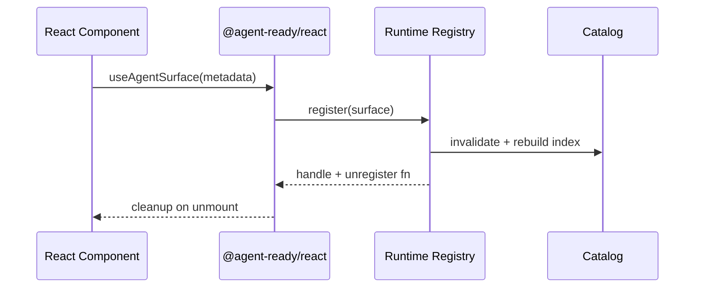
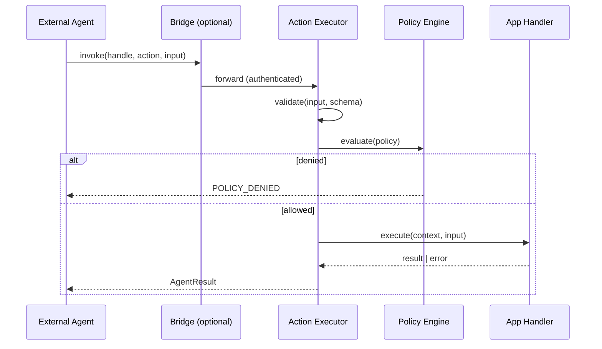

# Agent Ready React SDK — 架构设计

> **版本**: 0.1.0-draft  
> **状态**: Architecture RFC  
> **受众**: SDK 维护者、平台工程师、Agent 集成方

## 1. 愿景与问题定义

### 1.1 愿景

**Agent Ready React SDK** 是一套面向 React 应用的**声明式元数据与运行时契约层**，使 UI 对 AI Agent（IDE Agent、自主 Agent、MCP Client、Eval Bot）具备：

- **可发现**（Discoverable）：Agent 能枚举页面/区域内的可操作单元与可读状态
- **可理解**（Understandable）：每个单元带有机器可解析的 Schema、语义角色与约束
- **可执行**（Actionable）：Agent 通过稳定、可审计的 API 触发用户意图等价操作
- **可观测**（Observable）：Agent 能订阅结构化状态快照，而非解析 DOM 文本
- **可治理**（Governable）：权限、速率、副作用域在宿主应用内显式声明

SDK **不包含业务逻辑**；它只提供注册、编目、路由、校验、观测与桥接机制，由应用在边界内注入领域行为。

### 1.2 非目标

| 非目标 | 说明 |
|--------|------|
| 替代 React 状态管理 | 不与 Redux/Zustand/Jotai 竞争，仅暴露 Agent 视图层 |
| 通用 RPA / DOM 自动化 | 不鼓励 `querySelector` + `click()` 作为主路径 |
| Agent 运行时 | 不内置 LLM、Planner、Memory；由外部 Agent 消费 SDK |
| 设计系统组件库 | 不提供 Button/Table 等业务组件 |

### 1.3 设计原则

1. **Schema-first**：一切 Agent 可见面对外以 JSON Schema（或 Zod 推导）为单一事实来源
2. **Opt-in by default**：未注册节点对 Agent 不可见，避免意外泄露
3. **Host owns authority**：执行权在应用；SDK 只做校验与派发
4. **Deterministic over clever**：优先稳定 ID、版本化契约，而非启发式 DOM 推断
5. **Progressive adoption**：可按路由/Feature 切片接入，无需一次重写
6. **Framework-aligned**：遵循 React 19 并发、Suspense、Server Components 边界

---

## 2. 概念模型

```
┌─────────────────────────────────────────────────────────────────┐
│                        External Agent Layer                      │
│   (Cursor, Custom Agent, MCP Client, Test Harness, Eval Runner) │
└────────────────────────────┬────────────────────────────────────┘
                             │ JSON-RPC / MCP / HTTP (optional)
                             ▼
┌─────────────────────────────────────────────────────────────────┐
│                     @agent-ready/bridge (可选)                   │
│          Transport · Auth · Session · Rate Limit · Audit         │
└────────────────────────────┬────────────────────────────────────┘
                             │
                             ▼
┌─────────────────────────────────────────────────────────────────┐
│                     @agent-ready/runtime                         │
│   Registry · Catalog · Action Router · State Snapshot · Policy   │
└────────────────────────────┬────────────────────────────────────┘
                             │
              ┌──────────────┼──────────────┐
              ▼              ▼              ▼
┌──────────────────┐ ┌──────────────┐ ┌──────────────────┐
│ @agent-ready/    │ │ @agent-ready/│ │ @agent-ready/    │
│ react            │ │ schema       │ │ observability    │
│ (Providers,      │ │ (Zod/JSON    │ │ (Events, Trace,  │
│  Hooks, HOCs)    │ │  Schema)     │ │  Metrics)        │
└────────┬─────────┘ └──────────────┘ └──────────────────┘
         │
         ▼
┌─────────────────────────────────────────────────────────────────┐
│              Host Application (Business Code — 边界外)            │
│   Pages · Features · Domain Stores · API Clients                │
└─────────────────────────────────────────────────────────────────┘
```

### 2.1 核心实体

| 实体 | 定义 | 生命周期 |
|------|------|----------|
| **Surface** | Agent 可交互的逻辑界面单元（页面片段、Modal、Drawer、Widget） | 随 React 树挂载/卸载 |
| **Capability** | Surface 对外声明的能力集合（read / act / subscribe） | 静态声明 + 运行时校验 |
| **Action** | 具名、带输入 Schema 的副作用入口，映射到应用 handler | 注册时绑定，版本化 |
| **Observation** | 只读状态切片，带 JSON Schema 与刷新策略 | 订阅式推送或拉取 |
| **Handle** | 全局唯一、稳定的 Agent 寻址符（`app://domain/surface/id`） | 应用分配，可迁移映射表 |
| **Policy** | 谁能在什么上下文执行什么 Action | 每 Session / 每 Role 求值 |
| **Catalog** | 当前已注册 Surface 的索引快照 | 内存 + 可选持久化 |

### 2.2 Handle 命名规范

```
{namespace}://{scope}/{surfaceType}/{localId}[?v={version}]
```

示例：

- `crm://deals/detail-panel/deal-9281?v=2`
- `admin://users/table?page=3`

**规则**：`localId` 由应用生成且在同一 `scope` 内唯一；`version` 用于破坏性 Schema 变更。

---

## 3. 分层架构

### 3.1 Layer 0 — Schema & Types (`@agent-ready/schema`)

- 定义跨包共享的 TypeScript 类型与 Zod Schema
- 从 Zod 生成 JSON Schema（供 Agent prompt、OpenAPI、MCP tool 描述复用）
- **无 React 依赖**，可在 Node/Bundler/CI 使用

### 3.2 Layer 1 — Runtime Kernel (`@agent-ready/runtime`)

| 子系统 | 职责 |
|--------|------|
| **Registry** | Surface/Action/Observation 注册与注销 |
| **Catalog Builder** | 构建 Agent 可消费的目录树（过滤、分页、搜索） |
| **Action Executor** | 校验输入 → Policy 检查 → 调用 handler → 结构化结果/错误 |
| **Snapshot Engine** | 合并多个 Observation 为一致性快照（可选 debounce） |
| **Policy Engine** | RBAC / Allowlist / 环境门禁（prod 禁危险 Action） |
| **Event Bus** | 内部事件：`surface:registered`, `action:invoked`, `policy:denied` |

**约束**：Runtime 不 import React；通过 adapter 注入异步调度（`queueMicrotask` / `scheduler`）。

### 3.3 Layer 2 — React Integration (`@agent-ready/react`)

| API 面 | 用途 |
|--------|------|
| `<AgentReadyProvider>` | 注入 runtime、session、policy、logger |
| `useAgentSurface()` | 声明 Surface 元数据，绑定生命周期 |
| `useAgentAction(handle, …)` | 显式 handle 注册 Action + 自动注销 |
| `useAgentObservation()` | 注册 Observation + 订阅应用状态 |
| `useAgentCatalog()` | 宿主 UI 或 DevTools 读取目录 |
| `<AgentBoundary>` | 错误隔离；Surface 崩溃不影响 Agent 通道 |

**React 19 对齐**：

- 使用 `useEffectEvent`（或等价 stable callback）避免 handler 陈旧闭包
- Server Components：仅在 Client Boundary 内注册；RSC 通过 serializable manifest 预声明静态 Capability
- Suspense：Observation 可声明 `suspense: true`，Catalog 标记 `hydrationState`

### 3.4 Layer 3 — Tooling (`@agent-ready/cli`, `@agent-ready/eslint-plugin`)

- 静态分析：未注册交互控件、Schema 漂移、Handle 冲突
- Codegen：从 Zod 生成 MCP tool manifest、文档片段
- CI：`agent-ready validate` 校验 manifest 与运行时注册一致性

### 3.5 Layer 4 — Observability (`@agent-ready/observability`)

- OpenTelemetry 兼容 span：`agent.action.invoke`, `agent.observation.read`
- 可选 redaction hook（PII 字段脱敏）
- 与 `@agent-ready/devtools` 共享事件协议

### 3.6 Layer 5 — Bridge（可选）(`@agent-ready/bridge`, `@agent-ready/mcp`)

- 将 Runtime 暴露为 MCP Server / HTTP JSON-RPC
- 会话令牌、CORS、速率限制
- **默认不随 core 打包**，减少浏览器 bundle 体积

---

## 4. 关键流程

### 4.1 注册流程（Mount）



### 4.2 Action 调用流程



### 4.3 Observation 快照流程

1. Agent 请求 `observation.read` 或订阅 `observation.stream`
2. Snapshot Engine 收集注册源，应用 **redaction** 与 **size cap**
3. 返回带 `etag` 的快照；变更时推送 diff（可选）

**一致性模型**：最终一致；不保证跨 Surface 线性化，除非应用使用 `useAgentTransaction()` 显式批处理。

---

## 5. 安全与治理

### 5.1 威胁模型

| 威胁 | 缓解 |
|------|------|
| 未授权 Action 调用 | Session token + Policy + Action allowlist |
| 敏感状态泄露 | Observation schema 分级 + redaction + opt-in 字段 |
| Prompt 注入经 UI 回传 | 结构化输出；字符串字段 length cap |
| DoS（高频 invoke） | Rate limit per handle/action |
| 跨 Surface 提权 | Handle namespace 隔离；scope 级 Policy |

### 5.2 Policy 求值顺序

```
defaultDeny → roleRules → environmentRules → perActionOverride → auditLog
```

### 5.3 错误分类（稳定错误码）

| Code | HTTP 映射 | 含义 |
|------|-----------|------|
| `AGENT_SURFACE_NOT_FOUND` | 404 | Handle 不存在或已卸载 |
| `AGENT_ACTION_NOT_FOUND` | 404 | Action 未注册 |
| `AGENT_VALIDATION_FAILED` | 400 | 输入 Schema 不匹配 |
| `AGENT_POLICY_DENIED` | 403 | 策略拒绝 |
| `AGENT_HANDLER_ERROR` | 500 | 业务 handler 抛错（message 可配置脱敏） |
| `AGENT_RATE_LIMITED` | 429 | 超限 |

---

## 6. 与 Agent 生态的互操作

### 6.1 MCP（Model Context Protocol）

- `@agent-ready/mcp` 将 Catalog → `tools/list`，Action → `tools/call`
- Observation → `resources/read` 或 custom notification
- Schema 与 MCP inputSchema 自动对齐

### 6.2 文档与 Prompt 生成

- `catalog.toPromptContext()` 产出压缩目录（Token budget 感知）
- 支持 **tiered detail**：`summary` | `full` | `debug`

### 6.3 测试 Harness

- `@agent-ready/testing` 提供内存 Bridge + fake Agent session
- 契约测试：给定 input fixture → 期望 AgentResult

---

## 7. 性能与体积预算

| 指标 | 目标 (gzipped) |
|------|----------------|
| `@agent-ready/react` + `@agent-ready/runtime` | < 12 KB（tree-shaken 基线） |
| 首次 Catalog 构建 (100 surfaces) | < 16 ms (median) |
| Action invoke 开销（不含 handler） | < 2 ms |

**策略**：Catalog 增量更新；Observation debounce；Schema 编译缓存；Bridge 独立分包。

---

## 8. 扩展点

| 扩展点 | 接口 |
|--------|------|
| Custom Handle Resolver | `runtime.registerResolver()` |
| Policy Backend | `PolicyProvider` async |
| Transport | `BridgeAdapter` |
| Redaction | `ObservationMiddleware[]` |
| Persistence | `CatalogStorage`（IndexedDB / server sync） |

---

## 9. 架构决策记录（ADR 摘要）

| ID | 决策 | 理由 |
|----|------|------|
| ADR-001 | Schema 以 Zod 为源，生成 JSON Schema | DX 好，与 TS 类型同源 |
| ADR-002 | Runtime 与 React 分离 | SSR/CLI/Node 测试无 React 依赖 |
| ADR-003 | Opt-in 注册，不做全局 DOM 扫描 | 安全、可预测、可测试 |
| ADR-004 | Handle 由应用显式分配 | 避免 React key 变化导致 Agent 寻址漂移 |
| ADR-005 | Bridge 可选包 | 浏览器 bundle 最小化 |
| ADR-006 | 默认 defaultDeny Policy | 企业合规友好 |
| ADR-007 | React Hooks 显式传入 `handle` | 多 Surface 场景可预测；与隐式 Context 绑定相比更易测试 |

---

## 10. 相关文档

- [package-design.md](./package-design.md) — Monorepo 与模块边界
- [sdk-api.md](./sdk-api.md) — 公共 API 契约
- [roadmap.md](./roadmap.md) — 分阶段交付计划
