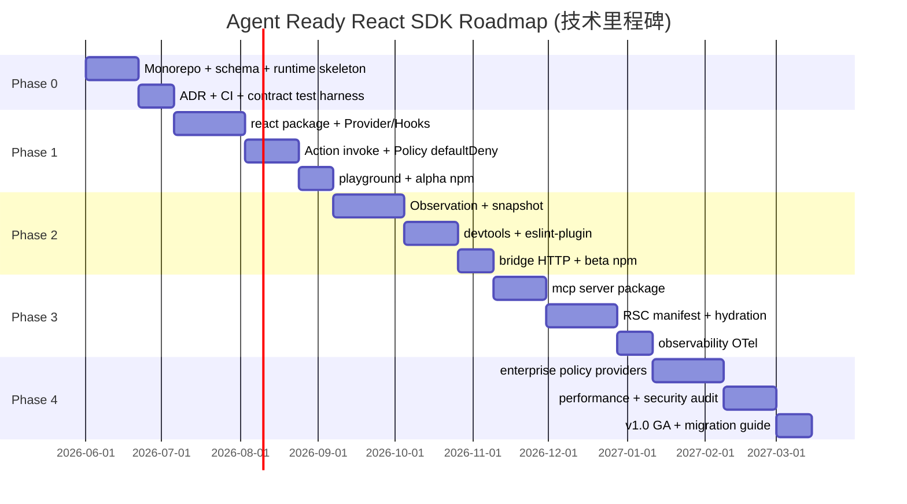

# Agent Ready React SDK — Roadmap

> **版本**: 0.1.0-draft  
> **规划周期**: 滚动发布，以 Phase 为里程碑（非日历承诺）

---

## 1. 战略目标

| 目标 | 成功指标 |
|------|----------|
| **可采纳** | 中型 React 应用可在 1 个 Feature 内完成试点集成 |
| **可验证** | 核心路径契约测试覆盖率 ≥ 90% |
| **可互操作** | 官方 MCP Server 通过 MCP Inspector 全绿 |
| **可信赖** | 默认 Policy 下无未注册交互面对 Agent 可见 |
| **可扩展** | 第三方 Transport 可在不 fork 的情况下接入 |

---

## 2. Phase 总览

```
Phase 0          Phase 1           Phase 2           Phase 3           Phase 4
Foundation   →   Agent Surface  →  Observable UI  →  Platform Scale →  Enterprise
(内部)           v0.1 alpha         v0.2 beta          v0.3 rc           v1.0 GA
```



---

## 3. Phase 0 — Foundation（内部）

**目标**：建立 Monorepo 骨架与不可动摇的类型/运行时契约。

### 交付物

| 项 | 说明 |
|----|------|
| Monorepo | pnpm + Turborepo + shared tsconfig |
| `@agent-ready/schema` | 全部核心类型 + Zod + JSON Schema 生成 |
| `@agent-ready/runtime` | Registry + Catalog + Action executor（无 Policy） |
| `@agent-ready/testing` | 契约测试基座 |
| CI | build / test / lint / typecheck / attw |
| 文档 | 本目录四篇设计文档定稿 v0.1 |

### 退出标准

- [ ] `createAgentRuntime` 可在 Node 单元测试中注册并 invoke Action
- [ ] Schema snapshot 测试锁定 JSON Schema 输出
- [ ] 零 `react` 依赖进入 `runtime` 包

### 风险

| 风险 | 缓解 |
|------|------|
| Zod v3/v4 分裂 | peerDependency 范围 + 抽象 `SchemaAdapter` |
| 过度设计 Catalog | Phase 0 仅 flat list，树形索引放 Phase 1 |

---

## 4. Phase 1 — Agent Surface（v0.1 alpha）

**目标**：React 应用能以最小 API 注册 Surface 与 Action，供测试 Agent 调用。

### 交付物

| 包 | 功能 |
|----|------|
| `@agent-ready/react` | Provider, `useAgentSurface`, `useAgentAction`, `AgentBoundary` |
| `@agent-ready/runtime` | Policy `defaultDeny` + role rules |
| `apps/playground` | 交互示例：注册、invoke、错误展示 |
| `@agent-ready/cli` | `validate` 子命令 MVP |

### API 冻结范围（alpha）

- `SurfaceManifest`, `ActionDefinition`, `InvokeActionRequest`
- `AgentReadyProvider`, `useAgentSurface`, `useAgentAction`

### 退出标准

- [ ] playground 演示端到端 invoke
- [ ] 契约测试：10+ 场景（成功、校验失败、Policy 拒绝、卸载后 NOT_FOUND）
- [ ] alpha 发布至 npm `beta` tag
- [ ] Quick Start 文档（README）

### 依赖项

- Phase 0 完成
- 选定错误码枚举并锁定

---

## 5. Phase 2 — Observable UI（v0.2 beta）

**目标**：Agent 可读结构化状态；开发者可调试；可选 HTTP Bridge。

### 交付物

| 包 | 功能 |
|----|------|
| `@agent-ready/react` | `useAgentObservation` |
| `@agent-ready/runtime` | Snapshot engine + etag + debounce |
| `@agent-ready/devtools` | Catalog 树、Action 日志、Policy 决策 |
| `eslint-plugin-agent-ready` | 核心 3 条规则 |
| `@agent-ready/bridge` | JSON-RPC over HTTP |
| `@agent-ready/observability` | 事件 API（无 OTel 亦可编译） |

### 退出标准

- [ ] Agent 可 `readObservation` 获取与 UI 一致的结构化数据
- [ ] DevTools 可 inspect 最近 100 次 invoke
- [ ] bridge 通过 e2e：HTTP client → runtime → handler
- [ ] beta 发布；提供从 alpha 迁移说明

### 指标

| 指标 | 目标 |
|------|------|
| Catalog 100 surfaces 构建 | < 16 ms p50 |
| bundle (@agent-ready/react) | < 12 KB gzip |

---

## 6. Phase 3 — Platform Scale（v0.3 rc）

**目标**：MCP 一等公民；RSC 支持；生产级观测。

### 交付物

| 包 | 功能 |
|----|------|
| `@agent-ready/mcp` | stdio + SSE MCP Server |
| `@agent-ready/react/rsc` | `declareAgentManifest` + hydration |
| `@agent-ready/runtime` | `subscribeObservation` stream |
| `@agent-ready/observability` | OpenTelemetry 可选集成 |
| `@agent-ready/cli` | `codegen mcp`, `codegen docs` |
| `apps/mcp-server-demo` | Cursor / Inspector 联调指南 |

### 退出标准

- [ ] MCP Inspector 全工具可调
- [ ] Next.js App Router 示例：RSC manifest + Client Action
- [ ] OTel span 在 playground 可见
- [ ] rc 发布；API 文档与 schema 自动生成

### 风险

| 风险 | 缓解 |
|------|------|
| RSC 边界复杂 | 仅支持静态 manifest；动态 Action 仍限 Client |
| MCP SDK 变更 | 版本 pin + 适配层 |

---

## 7. Phase 4 — Enterprise（v1.0 GA）

**目标**：大型企业可审计、可扩展、可合规地部署。

### 交付物

| 项 | 说明 |
|----|------|
| Policy Providers | OIDC role mapping、per-tenant allowlist |
| Audit log sink | 可插拔：console / HTTP / SIEM |
| Rate limiting | 按 session / action 可配置 |
| Security audit | 第三方或内部清单 |
| Performance | 压力测试报告 |
| Migration guide | alpha → beta → rc → v1.0 |

### 退出标准

- [ ] 默认 Policy 文档化 + 合规说明（SOC2 友好措辞）
- [ ] 破坏性变更窗口关闭，SemVer 承诺生效
- [ ] v1.0 `latest` 发布
- [ ] 6 个月 LTS 支持策略公布

---

## 8. 横向工作流（全 Phase 持续）

| 工作流 | 说明 |
|--------|------|
| **文档** | 每 PUBLIC API 变更同步 `sdk-api.md` + autogen |
| **契约测试** | 不允许降低覆盖率门槛 |
| **Changesets** | 每 PR 附带 changeset |
| **Dogfooding** | playground 先于 npm 发布验证 |
| **社区** | RFC 流程管理 breaking change |
| **安全** | `npm audit` + OWASP ASVS 相关条目跟踪 |

---

## 9. 技术选型汇总（决策记录）

| 领域 | 选型 | 备选 | 理由 |
|------|------|------|------|
| 语言 | TypeScript 5.5+ | — | 类型安全、生态 |
| 包管理 | pnpm | yarn, npm | 磁盘与 workspace 严格 |
| 构建 | tsup | rollup | 多包统一简单 |
| 编排 | Turborepo | nx | 学习曲线低 |
| Schema | Zod | Valibot, ArkType | 社区与 JSON Schema 工具链 |
| 测试 | Vitest | Jest | 速度、ESM 原生 |
| React | 18.3 + 19 | — | 并发、RSC |
| e2e | Playwright | Cypress | MCP/Bridge 测试 |
| 文档站 | VitePress | Docusaurus | 轻量 |
| MCP | `@modelcontextprotocol/sdk` | 自研 | 标准兼容 |
| 观测 | OpenTelemetry API | 自建 | 厂商中立 |
| 版本 | Changesets | semantic-release | 可控 changelog |

---

## 10. 非 Roadmap 项（明确延后）

以下请求 **不在 v1.0 范围内**，避免范围膨胀：

- 可视化 Agent 编排 UI
- 内置 LLM / Planner
- 非 React 框架（Vue/Svelte）官方绑定
- 自动 DOM 逆向注册
- 云端 Agent Ready Registry SaaS
- 移动端 React Native 官方支持（v1.0 后评估）

---

## 11. 里程碑检查表（维护者用）

复制到 Release Issue：

```markdown
## Release v0.x.y

- [ ] 所有 Phase 退出标准满足
- [ ] Changeset 版本正确
- [ ] 契约测试绿
- [ ] playground 手动冒烟
- [ ] sdk-api.md 版本矩阵更新
- [ ] 迁移指南（如有 breaking）
- [ ] npm publish + GitHub Release
- [ ] 公告 / Changelog
```

---

## 12. 相关文档

- [architecture.md](./architecture.md)
- [package-design.md](./package-design.md)
- [sdk-api.md](./sdk-api.md)
- [tasks/README.md](./tasks/README.md) — 可执行任务拆分（≤2h / 可独立测试）
