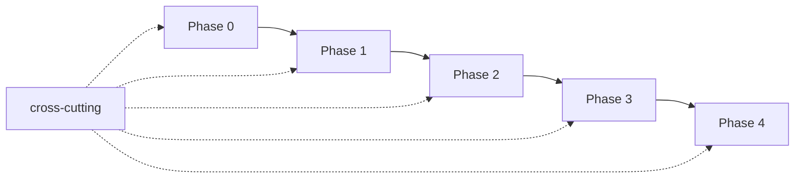

# Agent Ready React SDK — 任务拆分

> 基于 [roadmap.md](../roadmap.md) 拆分。  
> **约束**：单任务 ≤ 2 小时 · 可独立开发 · 可独立测试

## 1. 任务 ID 规范

```
{Phase}{序号}
```

| 前缀 | Phase | 目标版本 |
|------|-------|----------|
| `P0-` | Phase 0 — Foundation | 内部 |
| `P1-` | Phase 1 — Agent Surface | v0.1 alpha |
| `P2-` | Phase 2 — Observable UI | v0.2 beta |
| `P3-` | Phase 3 — Platform Scale | v0.3 rc |
| `P4-` | Phase 4 — Enterprise | v1.0 GA |
| `PX-` | 横向（全 Phase） | — |

## 2. 任务文档索引

| 文档 | 任务数 | 说明 |
|------|--------|------|
| [phase-0.md](./phase-0.md) | 22 | Monorepo、schema、runtime、testing、CI |
| [phase-1.md](./phase-1.md) | 20 | React 绑定、Policy、playground、alpha |
| [phase-2.md](./phase-2.md) | 26 | Observation、devtools、eslint、bridge、beta |
| [phase-3.md](./phase-3.md) | 18 | MCP、RSC、OTel、rc |
| [phase-4.md](./phase-4.md) | 14 | 企业策略、审计、限流、GA |
| [cross-cutting.md](./cross-cutting.md) | 8 | 文档、契约、发布、安全 |

**合计**：108 个任务（估算总计约 120–150 人时）

## 3. 任务卡片字段说明

每个任务包含：

| 字段 | 含义 |
|------|------|
| **估算** | 单人专注开发时间上限（≤ 2h） |
| **依赖** | 必须先合并的前置任务 ID；`—` 表示无 |
| **产出** | 本任务完成后可交付的工件 |
| **范围** | 做什么 / 不做什么 |
| **独立测试** | 不依赖其他进行中任务即可验证的命令或步骤 |

## 4. 依赖关系图（Phase 级）



## 5. 并行开发建议

同一 Phase 内，**依赖为 `—` 或仅依赖已完成任务** 的条目可并行：

| 可并行组 | 示例任务 |
|----------|----------|
| Phase 0 起步 | P0-001, P0-003, P0-004 |
| Schema 链 | P0-006 → P0-007 → P0-008 → P0-009 → P0-010（顺序） |
| Runtime 链 | P0-012 → P0-013 → P0-015 → P0-016（顺序） |
| Phase 1 契约测试 | P1-009 … P1-012 可在 P1-008 完成后并行 |
| Phase 2 工具 | P2-013 … P2-016（eslint）与 P2-017 … P2-021（bridge）并行 |

## 6. Phase 退出标准 ↔ 任务映射

| 退出标准（roadmap） | 覆盖任务 |
|---------------------|----------|
| `createAgentRuntime` 可注册并 invoke | P0-011 … P0-016, P0-018 |
| Schema snapshot 锁定 | P0-010 |
| runtime 零 react 依赖 | P0-011, P0-021 |
| playground 端到端 invoke | P1-015 … P1-017 |
| 契约测试 10+ 场景 | P1-009 … P1-012 |
| Observation 可读 | P2-001 … P2-005 |
| bridge e2e | P2-022 |
| MCP Inspector 全绿 | P3-001 … P3-006, P3-016 |
| v1.0 GA | P4-011 … P4-014 |

## 7. 领取任务流程

1. 在 Issue/看板创建卡片，标题：`[P0-006] schema 核心类型`
2. 确认 **依赖** 已合并 `main`
3. 仅改 **范围** 内路径；单 PR 对应单任务（推荐）
4. 按 **独立测试** 验收后提 PR，附任务 ID

## 8. 相关文档

- [../roadmap.md](../roadmap.md)
- [../package-design.md](../package-design.md)
- [../sdk-api.md](../sdk-api.md)
- [../architecture.md](../architecture.md)
